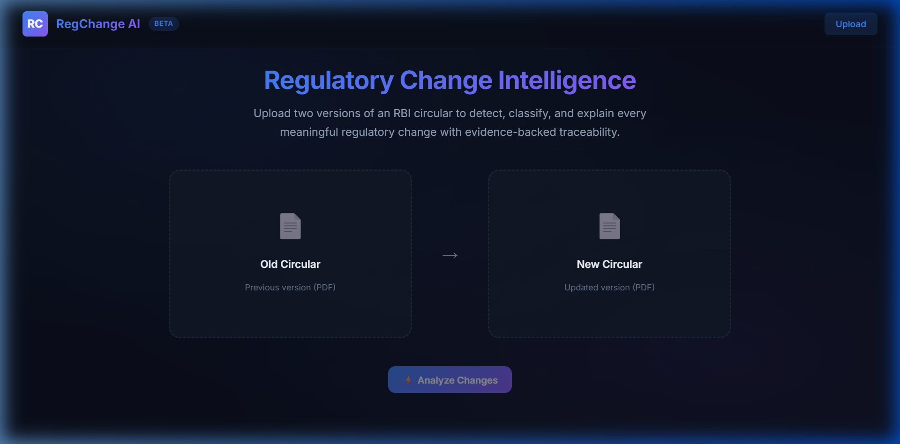
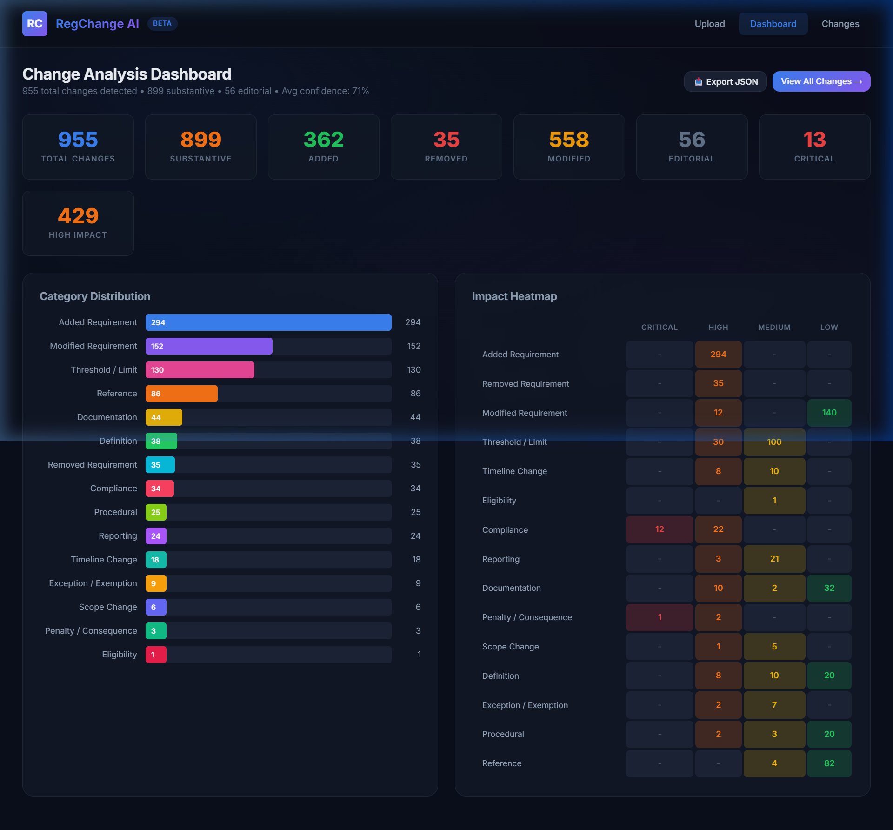
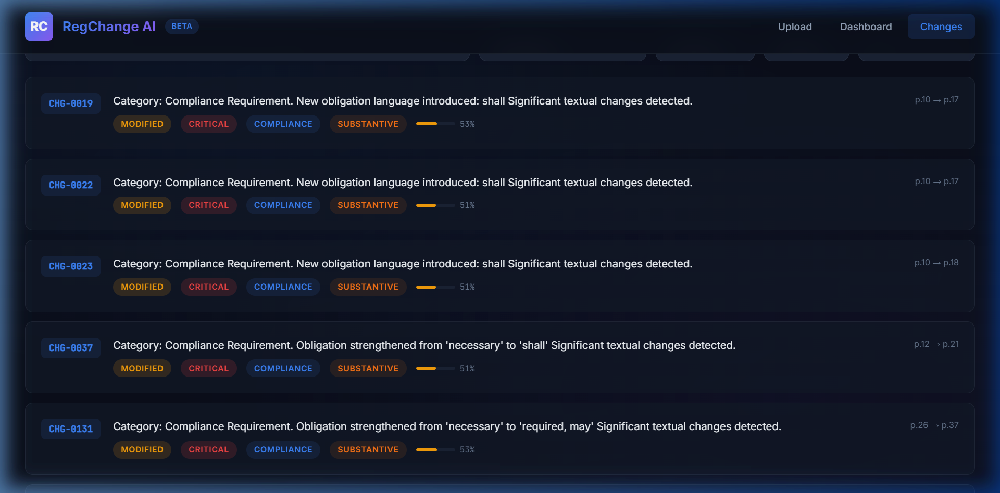
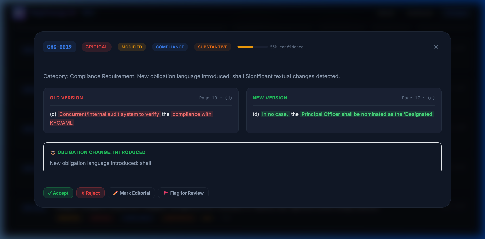
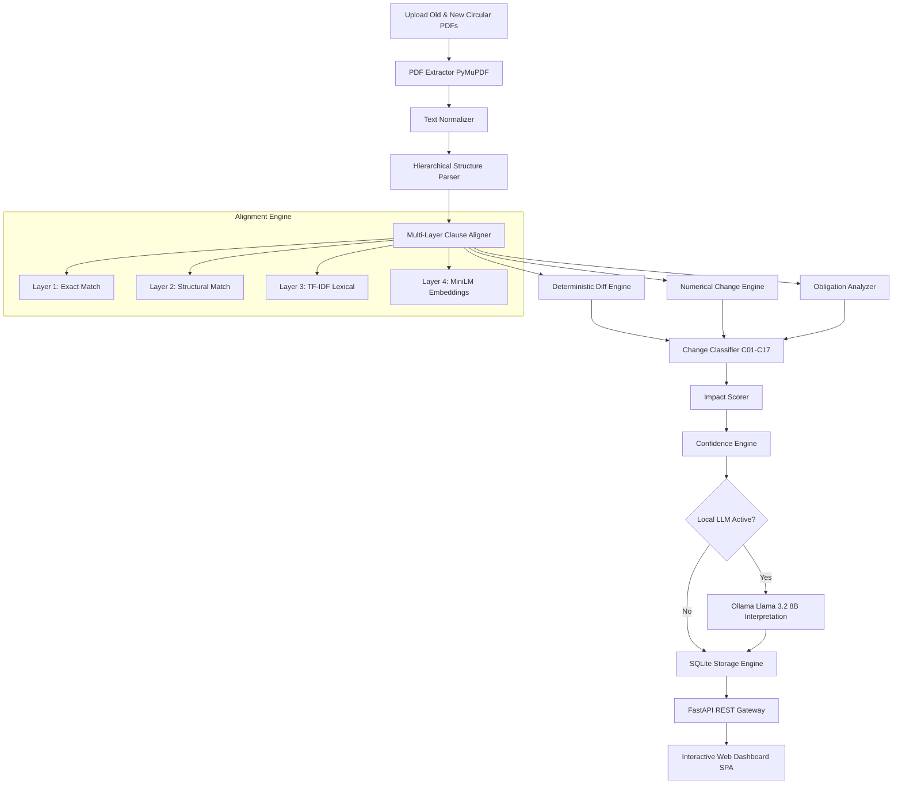

# RegChange AI — Regulatory Change Intelligence Platform

<p align="center">
  
</p>

<p align="center">
  <a href="#-key-features"></a>
  <a href="#-architecture"></a>
  <a href="#-architecture"></a>
  <a href="#-architecture"></a>
  <a href="#-architecture"></a>
  <a href="#-local-llm-integration"></a>
</p>

---

## 📌 Executive Summary

**RegChange AI** is an AI-powered regulatory document comparison and change intelligence platform built specifically for complex regulatory circulars (such as **Reserve Bank of India (RBI)** Master Directions, Guidelines, and Notifications).

Unlike generic PDF diff tools or opaque LLM summarizers, RegChange AI combines **Hierarchical Document Modeling**, **Multi-Layer Clause Alignment**, **Deterministic Regulatory Rule Engines** (Monetary, Obligation, Timeline), **Dense Embedding Semantic Matching**, and **Multi-Signal Confidence Scoring** to identify, categorize, prioritize, and trace every meaningful regulatory change with 100% auditable evidence.

> [!IMPORTANT]
> **Privacy & Governance First:** RegChange AI operates 100% locally on your infrastructure. All PDF extraction, semantic alignment, and classification run privately without sending sensitive financial documents to external third-party APIs.

---

## 📸 Verified UI & Visual Tour

### 1. Dual PDF Upload & Landing Interface
Clean, dark-mode glassmorphic interface supporting dual drag-and-drop upload of previous and updated regulatory circulars with quality score validation.


---

### 2. Change Intelligence Dashboard & Impact Heatmap
Real-time dashboard displaying key metrics, category distribution breakdown, and an interactive **Impact Heatmap** mapping regulatory categories against severity levels (`CRITICAL`, `HIGH`, `MEDIUM`, `LOW`).



---

### 3. Searchable Change Explorer
Filterable regulatory change explorer displaying change IDs, category tags, impact level badges, confidence bars, and page-level source provenance (`p.10 → p.17`).



---

### 4. Side-by-Side Diff & Obligation Analysis Modal
Detailed side-by-side comparison modal with inline word-level diff highlights (`green added` / `red removed`), modal verb obligation change alerts (`shall`, `must`, `may`), and human review actions (`Accept`, `Reject`, `Mark Editorial`, `Flag`).



---

## ⚡ Key Capabilities & Technical Highlights

- **Hierarchical Document Tree**: Parses PDFs into structured nodes (**Chapters**, **Sections**, **Subsections**, **Clauses**, **Definitions**, **Annexures**).
- **TOC & Noise Filter**: Automatically detects and ignores Table of Contents (dot-leaders), header/footer repetitions, and page numbers.
- **Multi-Layer Clause Alignment**: 4-stage matching cascade:
  1. *Exact Match*: Section number + normalized text.
  2. *Structural Match*: Heading similarity matching (handles renumbered clauses).
  3. *Lexical Match*: TF-IDF n-gram vector similarity.
  4. *Semantic Match*: Dense sentence embeddings via `all-MiniLM-L6-v2`.
- **Deterministic Numerical Engine**: Detects changes in monetary amounts (INR/Crores/Lakhs), percentages, deadlines, durations, and dates with magnitude calculation.
- **Obligation Change Analyzer**: Evaluates regulatory modal verbs (`shall`, `must`, `should`, `may`, `shall not`) and conditionality (`provided that`, `subject to`).
- **C01–C17 Regulatory Taxonomy**: Automatically categorizes changes into 17 standardized compliance classifications.
- **Multi-Signal Confidence Scoring**: Combines structural, lexical, semantic, numerical, and evidence scores into an aggregated confidence score.
- **Human Governance Workflow**: Audit trail with reviewer status updates (`ACCEPTED`, `REJECTED`, `EDITED`, `FLAGGED`).

---

## 🏗️ System Architecture



---

## 📊 C01–C17 Regulatory Taxonomy

RegChange AI classifies every detected change into an auditable 17-category taxonomy:

| Category Code | Name | Description | Base Impact |
|---|---|---|---|
| **C01** | Added Requirement | Completely new regulatory obligation introduced | HIGH |
| **C02** | Removed Requirement | Existing regulatory clause repealed or removed | HIGH |
| **C03** | Modified Requirement | Existing clause text reworded with substantive effect | MEDIUM |
| **C04** | Threshold / Limit Change | Monetary cap, transaction limit, or percentage altered | HIGH |
| **C05** | Timeline Change | Deadline, reporting window, or effective date altered | HIGH |
| **C06** | Eligibility Change | Entity qualification or eligibility criteria updated | HIGH |
| **C07** | Compliance Requirement | Mandatory obligation strengthened or introduced | CRITICAL |
| **C08** | Reporting Requirement | Return submission, FIU/STR filing requirement changed | HIGH |
| **C09** | Documentation Requirement | Record retention, KYC document requirements updated | MEDIUM |
| **C10** | Penalty / Consequence | Fines, sanctions, or enforcement action terms changed | CRITICAL |
| **C11** | Scope Change | Applicability extended or restricted to entities | HIGH |
| **C12** | Definition Change | Terminology or defined expression updated | MEDIUM |
| **C13** | Exception / Exemption | Conditional waiver or relaxation added/removed | HIGH |
| **C14** | Procedural Change | Workflow, validation, or operational process changed | MEDIUM |
| **C15** | Reference Change | Circular citation or Act section reference updated | LOW |
| **C16** | Clarification | Explanatory note or illustration added | INFORMATIONAL |
| **C17** | Editorial | Punctuation, capitalization, or formatting fix | INFORMATIONAL |

---

## 🧪 Empirical Benchmark Verification

RegChange AI was tested on two actual RBI Master Directions on KYC:
- **Previous Master Direction:** `18MDKYCE7A0F2A0494647248DBA377E4B9317E0.PDF` (59 Pages)
- **Updated Master Direction:** `MD18KYCF6E92C82E1E1419D87323E3869BC9F13.pdf` (107 Pages)

### Execution Summary Metrics

```text
============================================================
  REGCHANGE AI — EMPIRICAL BENCHMARK METRICS
============================================================
  Total Pages Processed    : 166 pages (59 old + 107 new)
  Processing Time          : 183.8 seconds (~3.0 minutes)
  Extraction Quality Score : 0.996 (Old) / 0.998 (New)
  Total Changes Detected   : 955 changes
  Substantive Changes      : 899 changes
  Editorial Changes        : 56 changes
  Average Confidence Score : 71%
============================================================
```

### Impact Breakdown
- 🚨 **CRITICAL**: 13 (Obligation strengthened to `shall`, `required`, penalty terms)
- 🟠 **HIGH**: 429 (New requirements, threshold & limit adjustments)
- 🟡 **MEDIUM**: 163 (Procedural changes, cross-references, documentation)
- 🟢 **LOW**: 294 (Minor rewordings, structural section realignments)
- ⚪ **INFORMATIONAL**: 56 (Formatting & editorial tweaks)

---

## 📂 Repository Structure

```text
AI Engineer/
├── assets/
│   └── images/               # Screenshots & visual assets for documentation
│       ├── landing_page.png
│       ├── dashboard_view.png
│       ├── explorer_view.png
│       └── modal_view.png
├── backend/
│   ├── config.py             # Global constants, paths, thresholds, and taxonomy
│   ├── main.py               # FastAPI server application & pipeline runner
│   ├── database/
│   │   └── db.py             # SQLite WAL database operations & statistics aggregator
│   ├── models/
│   │   ├── document.py       # Hierarchical Document Node & Tree data models
│   │   └── change.py         # ChangeRecord, NumericalChange, & Confidence models
│   ├── pipeline/
│   │   ├── pdf_extractor.py  # PyMuPDF text & metadata extraction engine
│   │   ├── normalizer.py     # Text, encoding, & currency equivalence cleaner
│   │   ├── structure_parser.py # Document hierarchy builder with TOC filter
│   │   ├── semantic_matcher.py # SentenceTransformer dense embedding matcher
│   │   ├── clause_aligner.py # 4-layer multi-strategy clause alignment engine
│   │   ├── diff_engine.py    # Word-level diff & inline HTML highlighter
│   │   ├── numerical_engine.py # Monetary, %, duration, & date change engine
│   │   ├── obligation_analyzer.py # Regulatory modal verb & conditionality analyzer
│   │   ├── change_classifier.py # C01-C17 rule-based classification engine
│   │   ├── impact_scorer.py # Deterministic impact level calculation
│   │   ├── confidence_engine.py # Multi-signal confidence scoring
│   │   └── llm_classifier.py # Ollama Llama 3.2 8B integration with fallbacks
│   └── prompts/
│       └── change_classifier_v1.txt # Prompt template with strict evidence guardrails
├── frontend/
│   ├── index.html            # Dark-mode Single Page Application (SPA)
│   ├── index.css             # Glassmorphism design system
│   └── app.js                # Frontend state, API integration, & modal rendering
├── data/                     # SQLite database storage directory
├── uploads/                  # Uploaded PDF storage directory
├── requirements.txt          # Python dependencies
├── test_pipeline.py          # End-to-end CLI verification script
└── README.md                 # Master Technical Documentation
```

---

## 🚀 Quickstart & Setup Guide

### 1. Prerequisites
- **Python 3.10+**
- *(Optional)* **Ollama** installed locally with `llama3.2:8b` model for AI interpretation.

### 2. Installation
Clone the repository and install the dependencies:

```powershell
# Navigate to project directory
cd "c:\Users\lalit\Desktop\AI Engineer"

# Install Python dependencies
pip install -r requirements.txt
```

### 3. Run Web Application
Launch the FastAPI gateway server:

```powershell
python -m uvicorn backend.main:app --reload --host 0.0.0.0 --port 8000
```

Open your browser at **`http://localhost:8000`** to access the dashboard.

### 4. Run CLI Pipeline Benchmark
You can also run the full comparison pipeline directly from the command line:

```powershell
python test_pipeline.py
```

---

## 📡 REST API Reference

| Endpoint | Method | Description |
|---|---|---|
| `/api/v1/documents/upload` | `POST` | Upload a PDF document (`version=old` or `new`) |
| `/api/v1/comparisons` | `POST` | Start background comparison (`old_document_id`, `new_document_id`) |
| `/api/v1/comparisons/{id}` | `GET` | Get real-time comparison status and progress |
| `/api/v1/comparisons/{id}/changes` | `GET` | Filter changes by category, impact, type, or search term |
| `/api/v1/comparisons/{id}/changes/{change_id}` | `GET` | Fetch detailed change record with diffs & references |
| `/api/v1/comparisons/{id}/statistics` | `GET` | Retrieve aggregated dashboard statistics & heatmap |
| `/api/v1/comparisons/{id}/export/excel` | `GET` | Export 100% of identified changes dump as formatted `.xlsx` workbook |
| `/api/v1/changes/{change_id}/review` | `POST` | Update human review status (`ACCEPTED`, `REJECTED`, `EDITED`, `FLAGGED`) |

---

## 🛡️ Auditing & Evidence Traceability

Every change record produced by RegChange AI contains strict provenance data:
1. **Source References**: Page numbers, section numbers, clause headings, and verbatim text snippets from both Old and New circulars.
2. **Evidence Quality Score**: Signals whether the alignment was exact, structural, lexical, or semantic.
3. **Diff Ops**: Complete character/word-level opcodes (`equal`, `insert`, `delete`, `replace`) rendered as clear HTML diff spans.
4. **Deterministic Reasoning**: Explanations derived from rule engines (obligation changes, numerical delta percentages) before invoking optional LLM summaries.

---

## 📄 License & Attribution

Developed for **RegChange AI**. All rights reserved. Built using FastAPI, PyMuPDF, Sentence Transformers, and Scikit-Learn.
